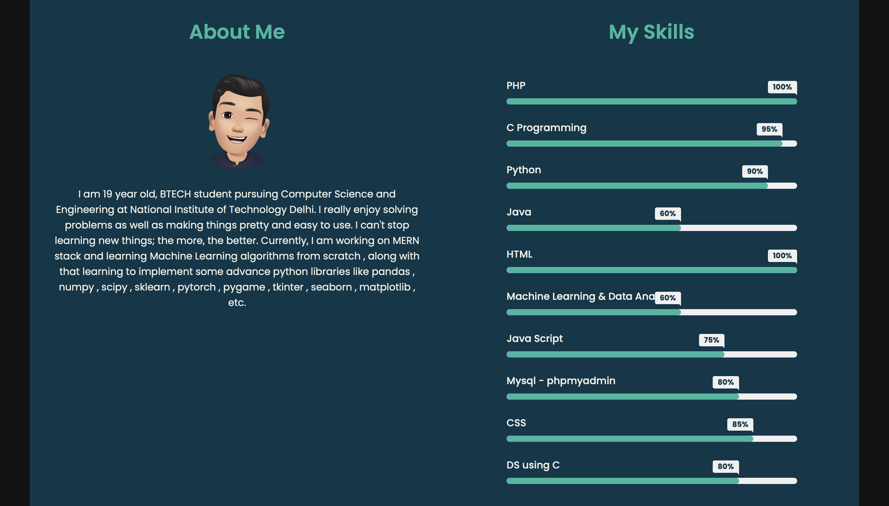

# Portfolio Builder
Welcome to my Portfolio Builder project! This project is a Portfolio Builder built using HTML, CSS, and JavaScript. It display users skill along with their info.

## Live Preview Link

I have used a lite server , so it might take some time to load the page.

Click Here : [Portfolio Builder](https://portfolio.fusycoder.freewebhostmost.com)

In order to open your portfolio again, you have to remembered your id, which you can get easily through url after successfully creating your portfolio - something like this : `https://portfolio.fusycoder.freewebhostmost.com/index.php?id=1`, from the url you can easily get your id.

## Screenshot

## Features

- Builder Form
- Skills Adder Form
- Contact Form
- Dynamic UI updates

## Programming Languages Used

- HTML
- CSS
- PHP

## Project Structure

The project is structured as follow : 
- `index.php` : The main HTML/PHP file for the Portfolio Builder (display users info).
- `builder.php` : The PHP file for the builder form of the Portfolio Builder.
- `portfolio-skills.php` : The PHP file for adding skills to the portfolio.
- `style.css` : The CSS file containing styles for the `index.php` file of the Portfolio Builder.
- `builder-style.css` : The CSS file containing styles for the `builder.php` and `portfolio-skills.php` file of the Portfolio Builder.
- `readme.md` : Provide brief description of the project.
- `assets` : Directory containing important data as follows :
  - `images` : Directory containing all the images used in the project.

## Contributing

Contributions are welcome! If you have any ideas, suggestions, or improvements, feel free to create a pull request or open an issue.

## Credits

- Icons and images from Internet.
- Designed by Aman Derwal.
